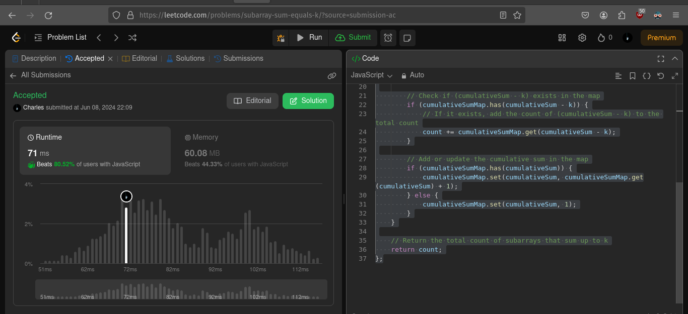

# COA Coding Challenge  🚀

## Image Gallery

## Description

This project is a simple image gallery showcasing different species of animals. Each image container displays a background image, species name, and country name. On hover, the background image transitions to grayscale and zooms in.

## Preview

## Setup Instructions

### Prerequisites

- A web browser to view output
- Visual Studio Code or any code editor to view and edit the code

### Files and Folders

- `index.html` : The main HTML file.
- `style.css` : The CSS file for styling the gallery.
- `index.js` : The JavaScript file for setting up background images.
- `assets/` : Folder containing the images (Fox.jpg, Whale.jpg, Baboon.jpg, Deer.jpg).

### Steps to Set Up

1. Clone this repository to your local machine: `git clone <repository_url>`

2. Open the `index.html` file in your browser to view the gallery.

3. Open the project in a code editor of your choice to view and edit the code.

## Technologies Used

- HTML
- CSS
- JavaScript

## Array Manipulation Challenge 🤯 😵‍💫

### Problem Statement:

Given an array of integers and a target sum, determine if there exists a contiguous
subarray within the array that sums up to the target. Return true if such a subarray exists,
otherwise return false.

#### _solution can be found in the [`arrayMap.js`](./challenges/arrayMap.js) file._

### **_#️⃣ Note_ :**

I found the problem was already on leetcode so i just used the tests to check if my solution was correct and complient to the time and complexity constraints ; and it was Correct 🥳 🚀 🚀 🚀 !!!

_Challenge Name on Leet Code : `Subarray Sum Equals K`_

## String Transformation 😘

### Problem Statement:

Given a string, transform it based on the following rules:

- If the length of the string is divisible by 3, reverse the entire string.
- If the length of the string is divisible by 5, replace each character with its ASCII code.
- If the length of the string is divisible by both 3 and 5 (i.e., divisible by 15), perform
  both operations in the order specified above.

  ####  _solution can be found in the [`stringTranform.js`](./challenges/stringTransform.js) file._

## Author

- UWITONZE Jean Charles

### Special Thanks

- Code of Africa for the Challenges and design. It was fun and challenging to solve the problems and design the gallery. 💟
