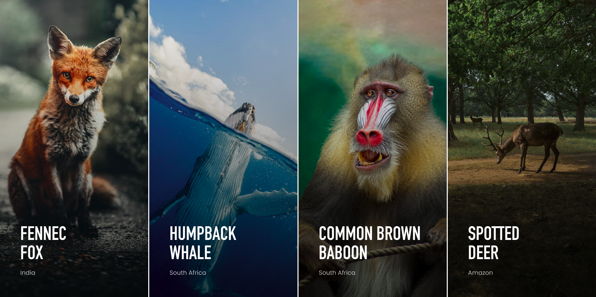

# COA Image Gallery

## Description

This project is a simple image gallery showcasing different species of animals. Each image container displays a background image, species name, and country name. On hover, the background image transitions to grayscale and zooms in.

## Preview

## Setup Instructions

### Prerequisites

- A web browser to view output
- Visual Studio Code or any code editor to view and edit the code

### Files and Folders

- `index.html` : The main HTML file.
- `style.css` : The CSS file for styling the gallery.
- `index.js` : The JavaScript file for setting up background images.
- `assets/` : Folder containing the images (Fox.jpg, Whale.jpg, Baboon.jpg, Deer.jpg).

### Steps to Set Up

1. Clone this repository to your local machine: `git clone <repository_url>`

2. Open the `index.html` file in your browser to view the gallery.

3. Open the project in a code editor of your choice to view and edit the code.

## Technologies Used

- HTML
- CSS
- JavaScript

## Author

- UWITONZE Jean Charles

### Special Thanks

- Code of Africa  for the Challenge and design.